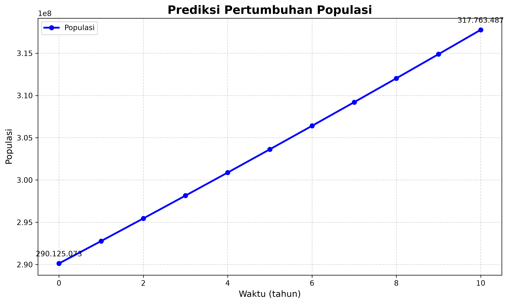

# Computational Physics

Kumpulan implementasi metode numerik dan simulasi dalam Python
untuk mata kuliah Fisika Komputasi.

## 📌 Daftar Isi

- [Tentang Project](#tentang-project)
- [Metode yang Digunakan](#metode-yang-digunakan)
- [Struktur Folder](#struktur-folder)
- [Instalasi](#instalasi)
- [Cara Menjalankan](#cara-menjalankan)
- [Contoh](#contoh)
- [Teknologi](#teknologi)
- [Author](#author)

---

## 🔬 Tentang Project

Project ini berisi implementasi berbagai metode numerik yang
digunakan dalam pembelajaran Fisika Komputasi.

Tujuan project ini adalah memahami bagaimana konsep matematika
dan fisika dapat diterapkan menggunakan pemrograman Python.

## 🧮 Metode yang Digunakan

Beberapa metode yang terdapat dalam repository ini:

- Simulasi Osilasi
- Model Pertumbuhan Populasi

  

