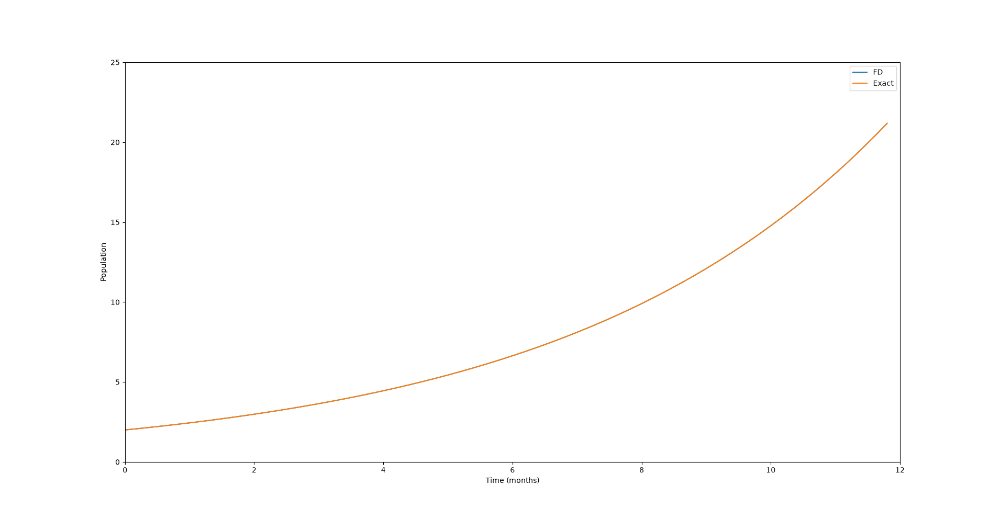
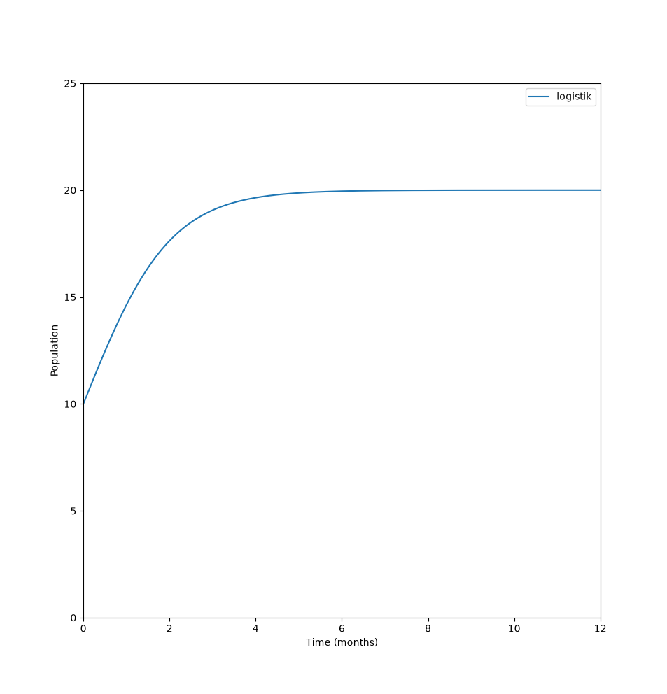
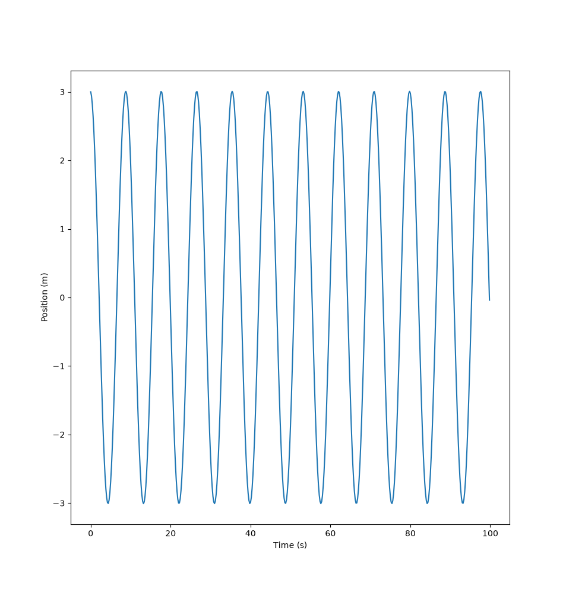
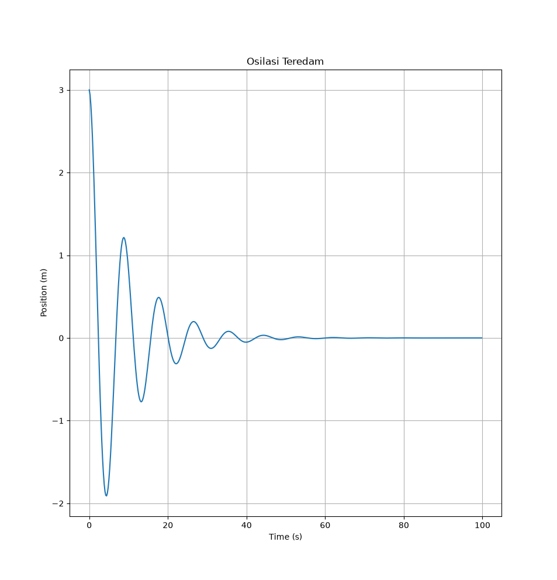

# Computational Physics

Kumpulan implementasi metode numerik dan simulasi dalam Python
untuk mata kuliah Fisika Komputasi.

## 📌 Daftar Isi

- [Tentang Project](#tentang-project)
- [Metode yang Digunakan](#metode-yang-digunakan)
- [Instalasi](#instalasi)
- [Output charts](#output-charts)
- [Author](#author)

---

## Tentang Project

Project ini berisi implementasi berbagai metode numerik yang
digunakan dalam pembelajaran Fisika Komputasi.

Tujuan project ini adalah memahami bagaimana konsep matematika
dan fisika dapat diterapkan menggunakan pemrograman Python.

## Metode yang Digunakan

Beberapa metode yang terdapat dalam repository ini:

- Simulasi Osilasi
- Model Pertumbuhan Populasi

## Instalasi

Clone Repository:

```bash
git clone https://github.com/username/Computational-Physics.git
cd Computational-Physics
```

Install Dependencies:

```bash
pip install numpy matplotlib scipy
```

## Output Charts

### Pertumbuhan Populasi r Konstan

<p align="center">
  
</p>


### Pertumbuhan Populasi r Non-Konstan

<p align="center">
  
</p>


### Osilasi Overdamped

<p align="center">
  
</p>


### Osilasi Underdamped

<p align="center">
  
</p>

## Author

**Helmi Saputra Bratama**

Physics Student  
Universitas Tanjungpura  
Pontianak, Indonesia

📚 Physics | 💻 Computational Physics | 🔬 Numerical Methods
