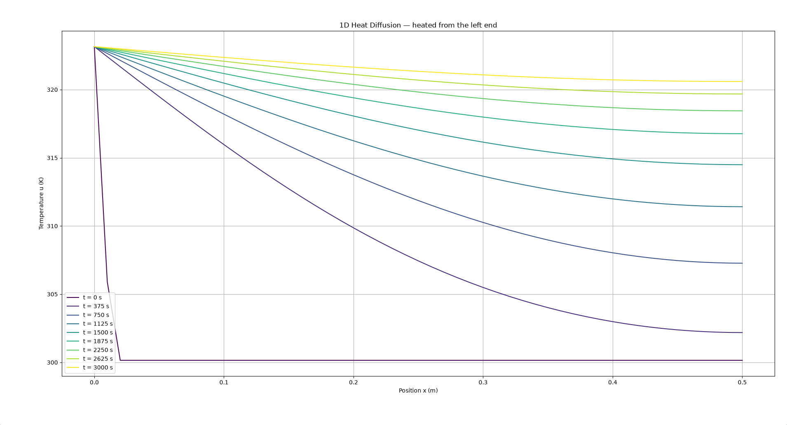
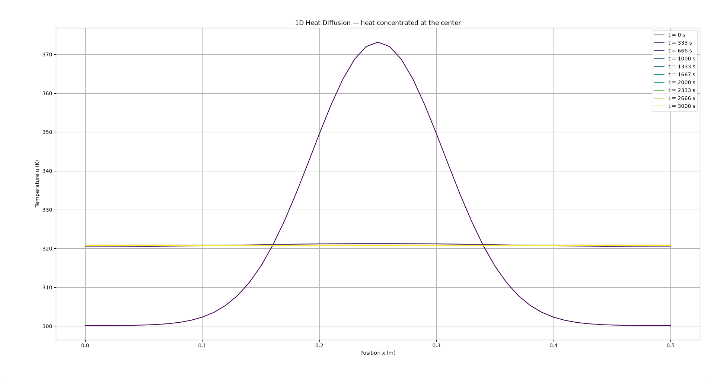
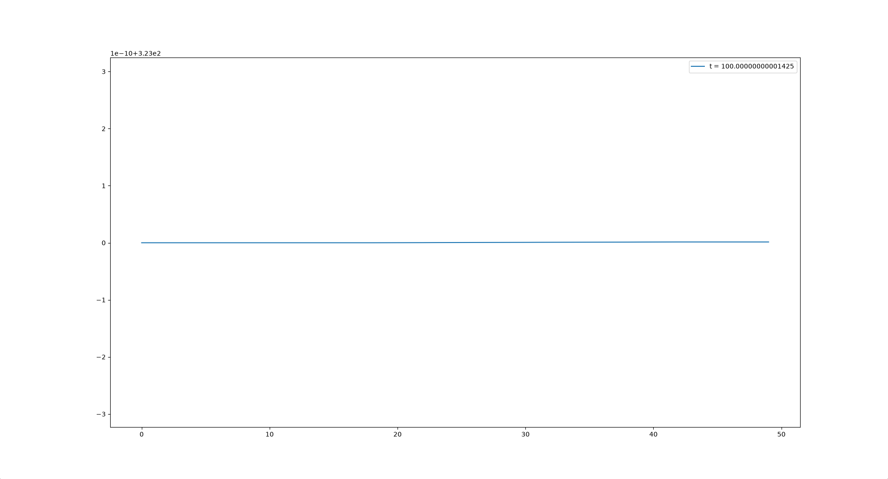
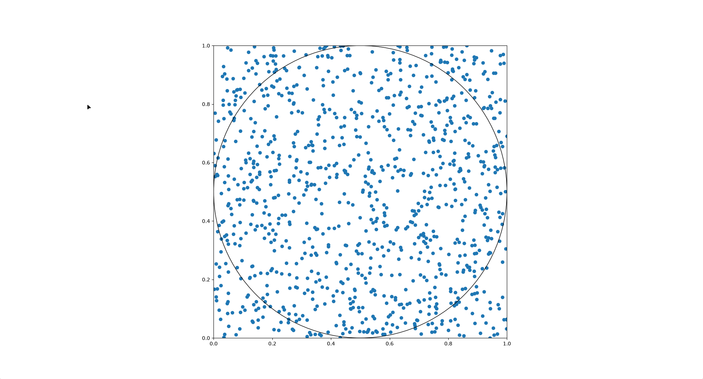
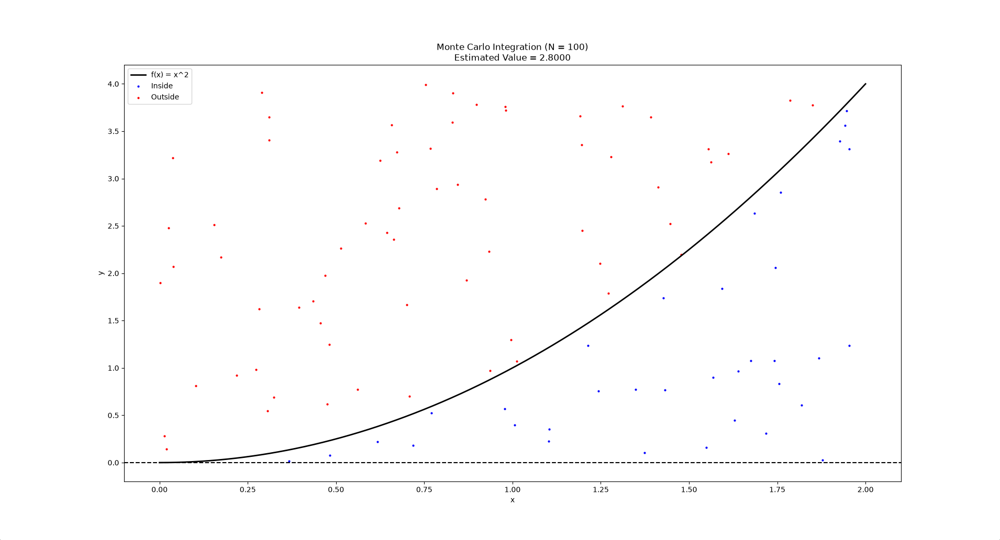
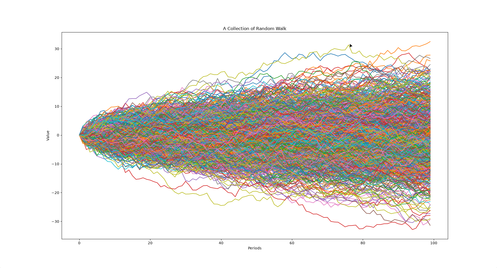
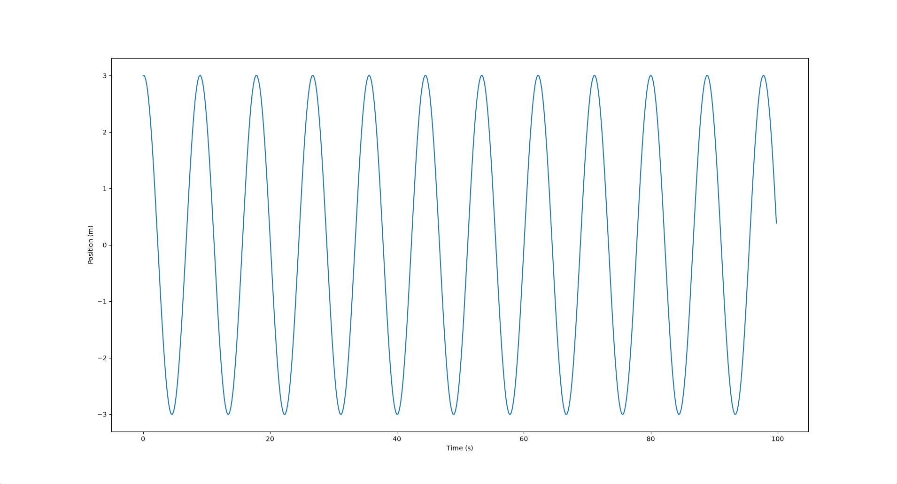
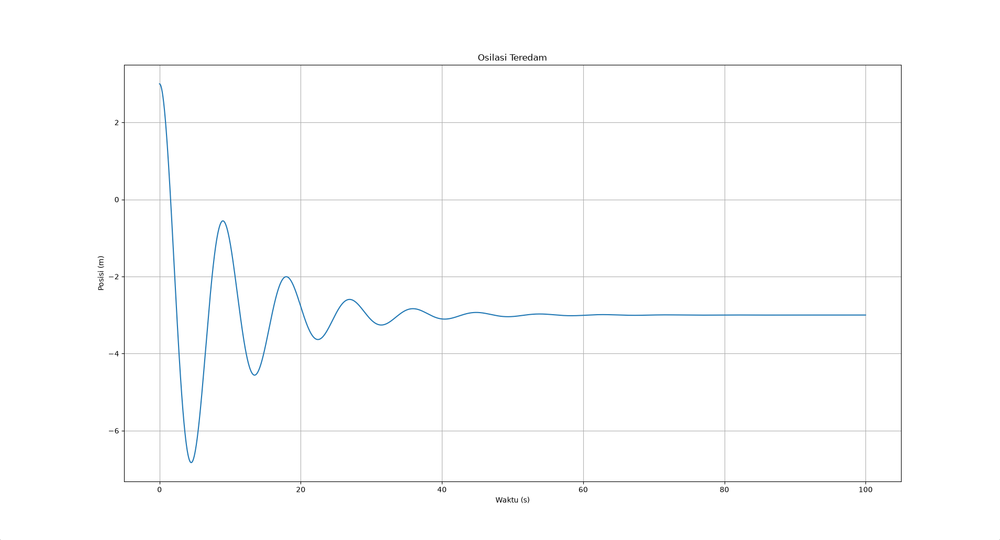
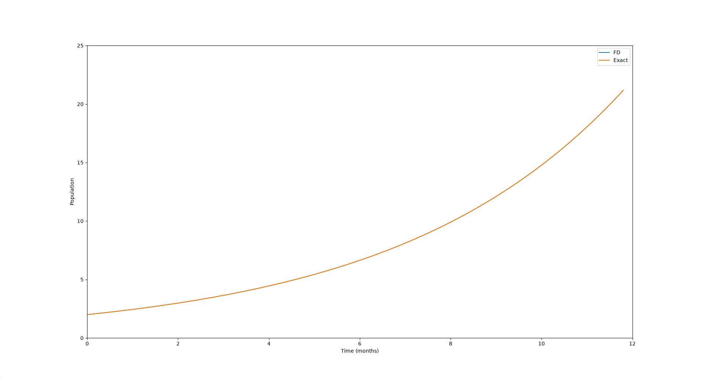
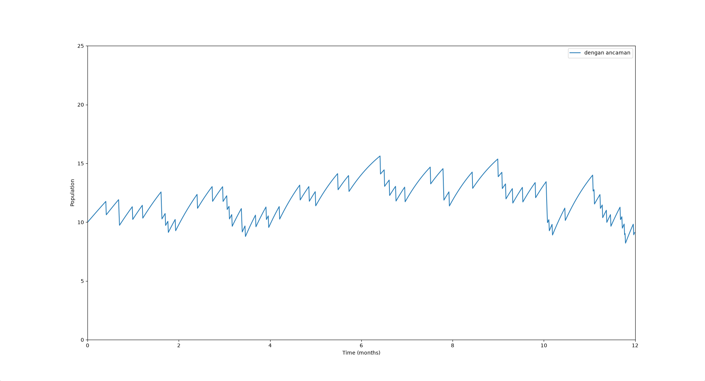

# Advance Computational Physics

Kumpulan implementasi metode numerik dan simulasi fisika dalam Python
untuk mata kuliah Fisika Komputasi.

## 📌 Daftar Isi

- [Tentang Project](#tentang-project)
- [Struktur Project](#struktur-project)
- [Daftar Project](#daftar-project)
- [Metode yang Digunakan](#metode-yang-digunakan)
- [Instalasi](#instalasi)
- [Output Charts](#output-charts)
- [Author](#author)

---

## Tentang Project

Project ini berisi implementasi berbagai metode numerik yang
digunakan dalam pembelajaran Fisika Komputasi.

Tujuan project ini adalah memahami bagaimana konsep matematika
dan fisika dapat diterapkan menggunakan pemrograman Python.

## Struktur Project

```text
computational-physics/
├── heat-equation/
│   ├── heat-rod.py
│   ├── heat-rod-centered.py
│   └── constant-t.py
├── monte-carlo/
│   ├── integral-mc.py
│   ├── pi-estimate.py
│   └── random-walk.py
├── oscillation/
│   ├── simple-oscillation-harmonic.py
│   └── damped-oscillation.py
├── people-growth/
│   ├── pg-r-constant.py
│   └── pg-r-non-constant.py
└── media/
```

## Daftar Project

| Project | Deskripsi | File |
| --- | --- | --- |
| **Heat Equation** | Simulasi difusi panas 1D pada kawat aluminium alloy menggunakan skema FTCS eksplisit, dengan variasi kondisi batas Dirichlet/Neumann dan suhu tetap. | `heat-equation/` |
| **Monte Carlo** | Estimasi nilai π, integrasi numerik, dan simulasi random walk menggunakan bilangan acak. | `monte-carlo/` |
| **Oscillation** | Simulasi osilasi harmonik sederhana dan osilasi teredam menggunakan metode beda hingga. | `oscillation/` |
| **People Growth** | Model pertumbuhan populasi eksponensial (r konstan) dan logistik (r tidak konstan), termasuk skenario ancaman dan bencana. | `people-growth/` |

## Metode yang Digunakan

Beberapa metode yang terdapat dalam repository ini:

- Metode beda hingga (finite difference) untuk persamaan panas dan osilasi
- Skema FTCS (Forward Time Centered Space) eksplisit
- Integrasi Monte Carlo dan estimasi π
- Simulasi random walk
- Model pertumbuhan populasi eksponensial dan logistik

## Instalasi

Clone Repository:

```bash
git clone https://github.com/username/Computational-Physics.git
cd Computational-Physics
```

Install Dependencies:

```bash
pip install numpy matplotlib scipy
```

Jalankan salah satu script, misalnya:

```bash
python heat-equation/heat-rod.py
```

## Output Charts

### Heat Equation

#### Panas Merambat dari Ujung Kiri

<p align="center">
  
</p>

#### Panas Dipusatkan di Tengah Kawat

<p align="center">
  
</p>

#### Suhu Tetap

<p align="center">
  
</p>

### Monte Carlo

#### Estimasi π

<p align="center">
  
</p>

#### Integrasi Monte Carlo

<p align="center">
  
</p>

#### Random Walk

<p align="center">
  
</p>

### Oscillation

#### Osilasi Harmonik Sederhana

<p align="center">
  
</p>

#### Osilasi Teredam

<p align="center">
  
</p>

### People Growth

#### Pertumbuhan Populasi r Konstan

<p align="center">
  
</p>

#### Pertumbuhan Populasi r Tidak Konstan (Logistik)

<p align="center">
  
</p>

## Author

**Helmi Saputra Bratama**

**NIM: H1021241015**

Physics Student  
Universitas Tanjungpura  
Pontianak, Indonesia

📚 Physics | 💻 Computational Physics
